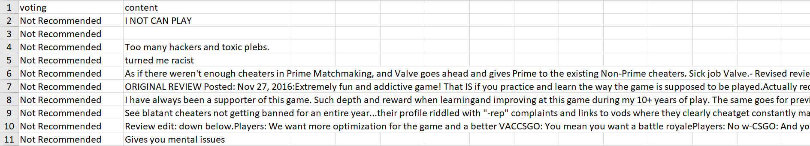
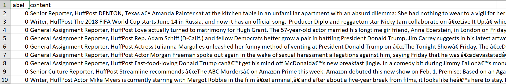
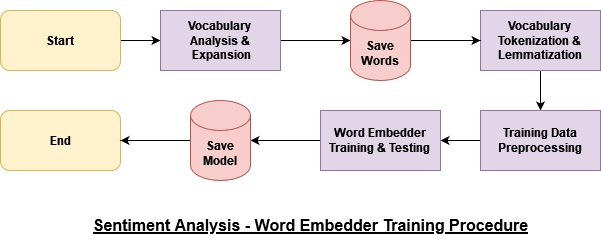
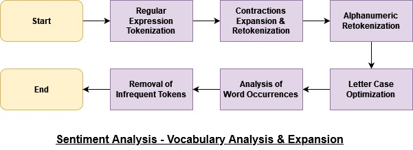
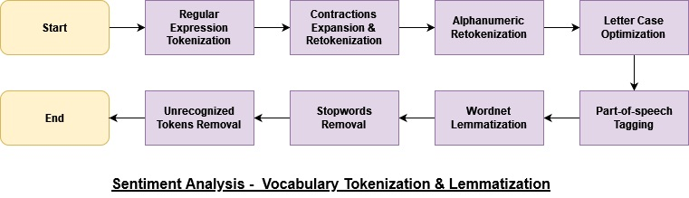
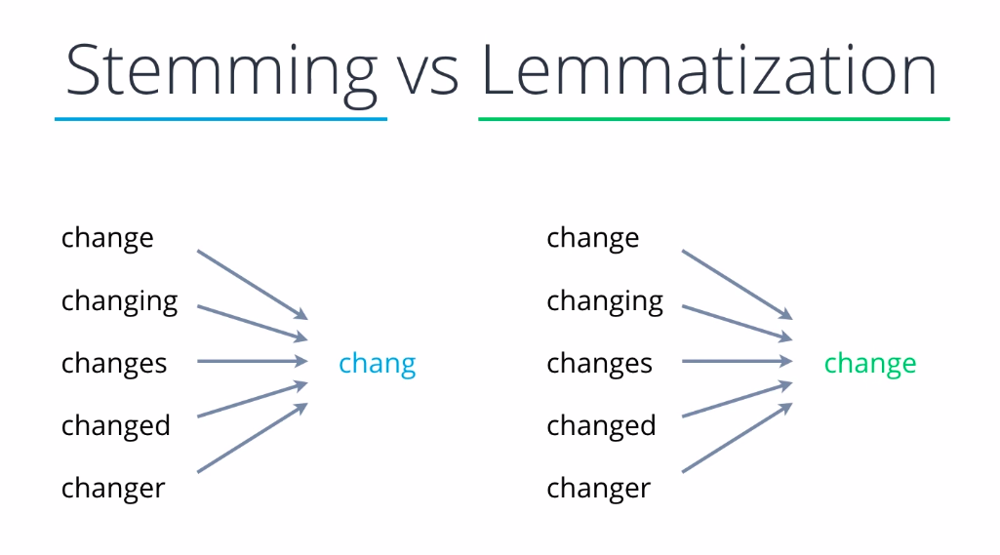
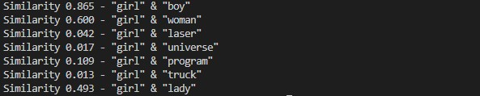

# NLP - Sentiment Analysis

## Problem Statement

**Question:** What is the problem we are trying to solve?

**Answer:** Given a short paragraph, we want to determine whether it contains positive or negative sentiments.

---

## Training Data

**Question:** What does the training data look like?

**Answer:** The training data is stored in CSV files under two columns: 'sentiment' and 'paragraph'. The 'sentiment' column can contain 'positive', 'negative' or 'neutral', while the 'paragraph' column contains the extracted text. The column names in the following data frames have not been unified. However, we can always find the training text under the column 'content'.

---

## Data Handling

**Question:** Where to get the data?

**Answer:** One of the most reliable sources for collecting sentimental paragraphs is customer reviews of a product. For this project, we are using game reviews from Steam as our training data for positive and negative sentiments. News articles are typically written in a neutral tone and seldom contain emotions because their purpose is to present factual information to readers. Therefore, we will use them as neutral training data.

**Question:** How to get the data?

**Answer:** There are various ways to obtain our training data. For dynamic websites like Steam, which present content to the client using JavaScript, we need tools like Selenium and Beautiful Soup to simulate a browser and parse the data. For news articles, we will download a dataset containing URLs to online newspapers from Kaggle and use Requests and Beautiful Soup to obtain the articles.

**Question:** How to store the data?

**Answer:** We store the training data in CSV files with two headers: 'sentiment' and 'paragraph'. To conserve disk space, all files are compressed and bundled into a ZIP file.

[Scraped Steam Reviews](https://drive.google.com/file/d/175SDxxaWLFDwc8rsS7HXR701Y98Sq_qL/view?usp=share_link)

[Scraped News Articles](https://drive.google.com/file/d/1-43d6oVSrXvQtsxqK5HgUn4gmDAA1Rtt/view?usp=share_link)

**Question:** What preprocessing do we need to do?

**Answer:** Unlike professionally-written news articles, Steam reviews can be informal and short, often containing special symbols and emojis. Therefore, we must filter out both symbols and extremely short paragraphs to remove low-quality training data. After filtering, we tokenize the remaining paragraphs using the following sequence: 'tokenization', 'part-of-speech tagging', and 'lemmatization' or 'stemming'. Depending on the model, we may also need to use 'word embedding'. The following diagram illustrates the general word embedder training process.

As stopwords typically lack semantic content in a sentence, it is common practice in NLP to remove them from the training data to simplify the problem. For instance, removing stopwords from the sentence "We would like to go to the mall" shortens it to "We like go mall" while preserving the original meaning. Nonetheless, stopwords such as 'not' that negate semantic meanings are essential for tasks like sentiment analysis. Therefore, we create a customized stopwords list that includes words that negate semantic meanings. The screenshot below displays the customized stopwords list we compiled (10/122).

There are several methods available for tokenizing a string, with the most basic being to split by spaces. However, this approach may not be ideal for compound words like "commonly-used", which could remain unbroken and negatively impact the performance of word embedding models, especially if they occur infrequently. In NLTK, there is a tokenizer called TreebankWordTokenizer that can tokenize sentences based on both whitespace and punctuation, and it can effectively break down contractions like "don't" into "do" and "n't", instead of "don" and "t".

However, for our purposes, we would like to expand contractions to their formal form. For example, "ain't" should become "am" and "not", rather than "ai" and "n't". To achieve this, we will use the RegexpTokenizer with the pattern "[a-zA-Z0-9\\']+" to first break the text down into tokens and then run them through a contractions expander. The following is an illustration of how the sentence "I don't like pies." is tokenized step by step.

'Lemmatization' and 'stemming' are techniques used in NLP to normalize words. 'Stemming' removes word suffixes to obtain root forms, but may yield non-words or different meanings. In contrast, 'lemmatization' maps words to base forms through dictionary or morphological analysis, leading to more accurate normalization, albeit slower and resource-intensive. 'Stemming' is faster and simpler, suited to tasks like information retrieval, while 'lemmatization' is more precise, beneficial for detailed tasks like machine translation. The following image juxtaposes 'stemming' and 'lemmatization' using 5 examples.

---

## Data Analysis (Model Training)

**Question:** What are the common approaches to solve this problem?

**Answer:** A naive approach for 'word embedding' is 'one-hot encoding', which encodes a single bit on a sparse matrix the size of the entire dictionary. 'Word2Vec' is a machine learning approach that vectorizes each token in a vector space based on the neighboring words such that similar words are closer. For binary classification tasks, such as spam mail detection, one could use CNN (Convolutional Neural Network) or RNN (Recurrent Neural Network). A more modern technique would be to use BERT (Bidirectional Encoder Representations from Transformers), which is typically used for tasks such as 'word embedding', 'machine translation', 'question answering', and more.

The following is the testing of the Word2Vec model trained using Gensim.

